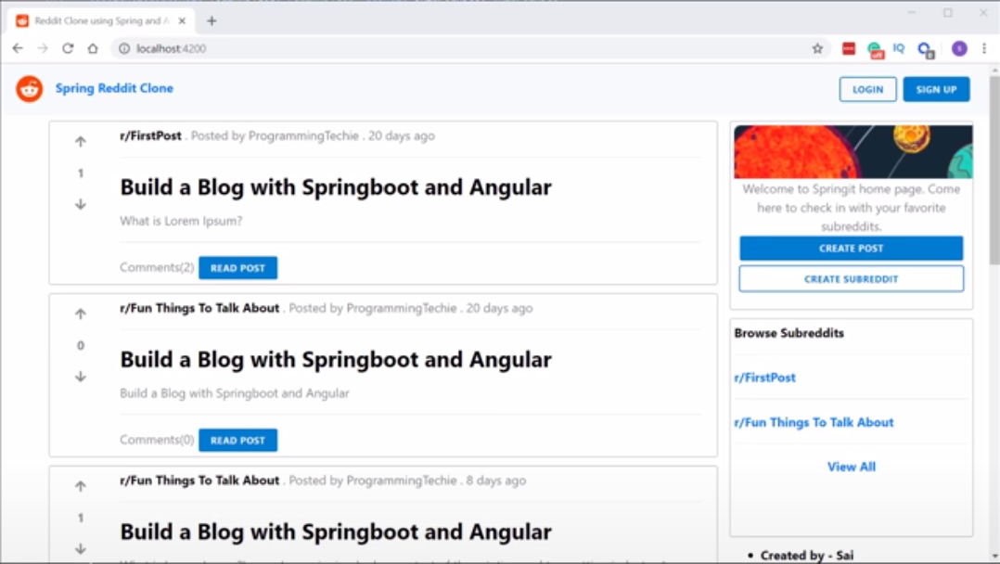

<!-- Color Palette for Session Status: https://www.color-hex.com/color-palette/35021 -->

# fccprogrammingtechie-sbaatbarccp-20200520

### Spring Boot and Angular Tutorial - Build a Reddit Clone (Coding Project)

<!-- Seasons of Japan: https://www.japanexplorer.com.au/japans-four-seasons/ -->
<!-- Autumn Color Palette Peg: https://www.schemecolor.com/autumn-in-japan-color-scheme.php -->

<b>Course Description:</b> Learn how to use Spring boot and Angular to build a Reddit clone.
  
We will be using Java 8, Spring Boot, Spring Security, Spring Data JPA, MySQL on the back-end side and on the front end we will be using Angular 9 and Bootstrap 4.
  
Also, we will be using Token Based Authentication in the form of JSON Web Tokens (JWT).

 

Learn how to use Spring boot and Angular to build a Reddit clone.

We will be using Java 8, Spring Boot, Spring Security, Spring Data JPA, MySQL on the back-end side and on the front end we will be using Angular 9 and Bootstrap 4.

Also, we will be using Token Based Authentication in the form of JSON Web Tokens (JWT).

💻 Code - Backend: https://github.com/SaiUpadhyayula/spring-reddit-clone

💻 Code - Frontend: https://github.com/SaiUpadhyayula/angular-reddit-clone

🔗 Written tutorial: https://programmingtechie.com/2020/05/14/building-a-reddit-clone-with-spring-boot-and-angular/
 

✏️ Course from Sai. Check out his YouTube channel: https://www.youtube.com/channel/UCD20RZV_WHQImisCW2QZwDw

⭐️ Course Contents ⭐️
1. ⌨️ (00:00) Intro and Demo
1. ⌨️ (03:50) Project Setup
1. ⌨️ (12:06) User Registration
1. ⌨️ (28:29) User Verification & Async Processing
1. ⌨️ (34:35) User Authentication with JWT
1. ⌨️ (47:48) JWT Validation & Subreddit API
1. ⌨️ (01:00:02) Intro to Mapstruct & Implement Post API
1. ⌨️ (01:16:56) Implement API to Manage Comments
1. ⌨️ (01:30:27) Implement API to Manage Votes
1. ⌨️ (01:41:24) Implement Logout using Refresh Tokens
1. ⌨️ (01:53:59) Getting started with Frontend Application
1. ⌨️ (01:58:28) Document REST API using Swagger & Springfox
1. ⌨️ (02:02:56) Implement User Registration in Angular application
1. ⌨️ (02:14:02) Implement Login in Angular Application
1. ⌨️ (02:21:17) Using Refresh Tokens in Angular Application
1. ⌨️ (02:29:41) Refactoring Home Page Component
1. ⌨️ (02:40:30) Create Subreddits and Posts in Angular Application
1. ⌨️ (02:50:52) Post Comments & Implement User Profile Page
1. ⌨️ (03:04:23) Final part - Implement Voting in Angular App

--

Learn to code for free and get a developer job: https://www.freecodecamp.org

Read hundreds of articles on programming: https://freecodecamp.org/news

---

<b>Table of Contents</b>

Coming Soon ...

---

# Coming Soon ...

---

<b>Table of Contents</b>

Coming Soon ...

---
